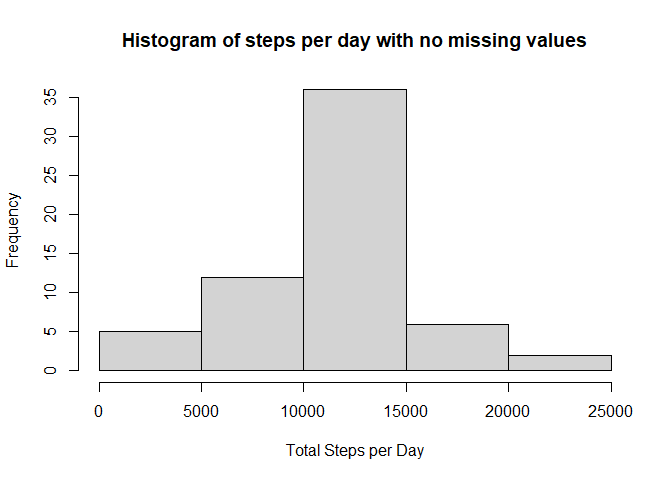
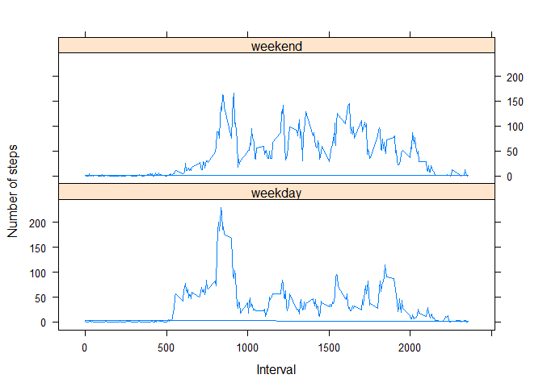

## Loading and preprocessing the data

Reading using `read.csv()` and convert date field

```r
# Make sure to have your dataset unzipped in `data` directory
# Make sure to have `lubridate` installed
library(lubridate,quietly = TRUE,warn.conflicts = FALSE)
```

```r
dt <- read.csv('data/activity.csv')
dt$date <- ymd(dt$date)
dt$dateTime <- dt$date + minutes(dt$interval)
head(dt)
```

```
##   steps       date interval            dateTime
## 1    NA 2012-10-01        0 2012-10-01 00:00:00
## 2    NA 2012-10-01        5 2012-10-01 00:05:00
## 3    NA 2012-10-01       10 2012-10-01 00:10:00
## 4    NA 2012-10-01       15 2012-10-01 00:15:00
## 5    NA 2012-10-01       20 2012-10-01 00:20:00
## 6    NA 2012-10-01       25 2012-10-01 00:25:00
```

## What is mean total number of steps taken per day?
From the code chunk above we can see that there are some missing values in the dataset. We should make sure to set `na.rm=TRUE`


```r
sumStepsPerDay<-tapply(dt$steps, dt$date, sum,na.rm=TRUE)
meanStepsPerDay <- mean(sumStepsPerDay);
medianStepsPerDay <- median(sumStepsPerDay)
hist(sumStepsPerDay,main = 'Histogram of steps per day',xlab = 'Total Steps per Day')
```

<!-- -->

```r
dev.copy(png,'figure/stepsPerDayHist.png')
dev.off();
```


The mean of total steps taken per day is 9354.2295082,
the median is 10395.

## What is the average daily activity pattern?

We should average the number of steps by date.
Some days have no value at all hence they should be excluded from the plot.

```r
averageStepsPerDayInterval <-tapply(dt$steps, dt$interval, mean,na.rm=TRUE)


plot(names(averageStepsPerDayInterval),
     averageStepsPerDayInterval,
     type='l',
     xlab = 'Interval',
     ylab = 'Average steps per day')
```

<!-- -->

```r
dev.copy(png,'figure/stepsPerDayTimeSeries.png')
dev.off()
maxInterval <- which.max(averageStepsPerDayInterval)
```
Interval 104 has the most number of steps

## Imputing missing values
Data has 2304 `NA`s. We will impute the missing values by filling them with the mean of the 5-minute interval.


```r
meanStepsPerInterval <- tapply(dt$steps,dt$interval,mean,na.rm=TRUE)
newDt <- dt
intervals <- newDt[is.na(newDt$steps),'interval']

## Make sure to use `as.character()` with intervals

meanStepsPerInterval <- meanStepsPerInterval[as.character(intervals)]

newDt[is.na(newDt$steps),'steps'] <- meanStepsPerInterval
head(newDt)
```

```
##       steps       date interval            dateTime
## 1 1.7169811 2012-10-01        0 2012-10-01 00:00:00
## 2 0.3396226 2012-10-01        5 2012-10-01 00:05:00
## 3 0.1320755 2012-10-01       10 2012-10-01 00:10:00
## 4 0.1509434 2012-10-01       15 2012-10-01 00:15:00
## 5 0.0754717 2012-10-01       20 2012-10-01 00:20:00
## 6 2.0943396 2012-10-01       25 2012-10-01 00:25:00
```


```r
sumStepsPerDayNoNAs<-tapply(newDt$steps, newDt$date, sum)
meanStepsPerDayNoNAs <- mean(sumStepsPerDayNoNAs)
medianStepsPerDayNoNAs <- median(sumStepsPerDayNoNAs)
hist(sumStepsPerDayNoNAs,
     main = 'Histogram of steps per day with no missing values',
     xlab = 'Total Steps per Day')
```

<!-- -->

```r
dev.copy(png,'figure/stepsPerDayHistNoNas.png')
dev.off()
```

The mean of total steps taken per day, with no missing values, is 1.076619\times 10^{4},
the median is 1.0766189\times 10^{4}.

The results differ slightly from the original data.

The median is the the same as the mean because all the missing values are filled with the mean, making the mean the most frequent value in the new data.


## Are there differences in activity patterns between weekdays and weekends?

```r
library(lattice)

newDt$dayType <- ifelse(weekdays(newDt$date) %in% c('Saturday','Sunday'),'weekend','weekday')
newDt$dayType <- as.factor(newDt$dayType)

weekends <- subset(newDt,dayType=='weekend')
weekdays <- subset(newDt,dayType!='weekend')
averageStepsPerWeekend <- tapply(weekends$steps,weekends$interval,mean)

averageStepsPerWeekday <- tapply(weekdays$steps,weekdays$interval,mean)

finalDt <- data.frame(steps=c(averageStepsPerWeekend,averageStepsPerWeekday),
                      dayType = c(rep('weekend',length(averageStepsPerWeekend)),
                                  rep('weekday',length(averageStepsPerWeekday))) )

finalDt$invervals <- as.numeric(row.names(finalDt))

xyplot(steps~intervals|dayType ,
       data = finalDt,
       type='l',
       layout= c(1,2),
       ylab = 'Number of steps',
       xlab='Interval')
```

<!-- -->

```r
dev.copy(png,'figure/stepsWeekdayWeekend.png')
dev.off()
```

We Notice that the number of steps increases at around the 700th interval.
